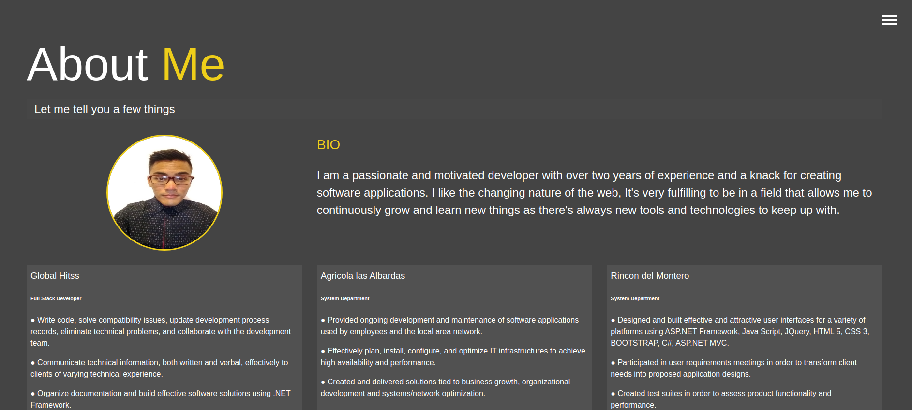

<!-- PROJECT LOGO -->
 

  <h2 align="center"> Modern Portfolio</h2>

  

    Project developed with HTML5, SASS and Vanilla Javascript that shows a responsive web design of my portfolio.
     
    <a href="https://github.com/YairFernando67/Modern_Portfolio"><strong>Explore the docs »</strong></a>
     
     
    <a href="https://github.com/YairFernando67/Modern_Portfolio/issues">Report Bug</a>
    ·
  

<!-- TABLE OF CONTENTS -->
## Table of Contents

* [About the Project](#about-the-project)
  * [Built With](#built-with)
* [Contact](#contact)

<!-- ABOUT THE PROJECT -->
## About The Project

This is a responsive web design based on my Portfolio.

### Built With
The project was developed using these tools and technologies.
* [SASS](https://sass-lang.com/)
* [Vanilla Js](http://vanilla-js.com/)
* [HTML5](https://www.w3schools.com/html/)

<!-- CONTACT -->
## Contact

Yair Fernando Facio Fraga - [YairFernando67](https://github.com/YairFernando67) - yair.facio11@gmail.com  

Project Link: [hhttps://github.com/YairFernando67/Modern_Portfolio](https://github.com/YairFernando67/Modern_Portfolio)

